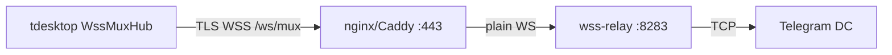
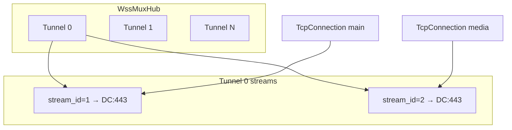
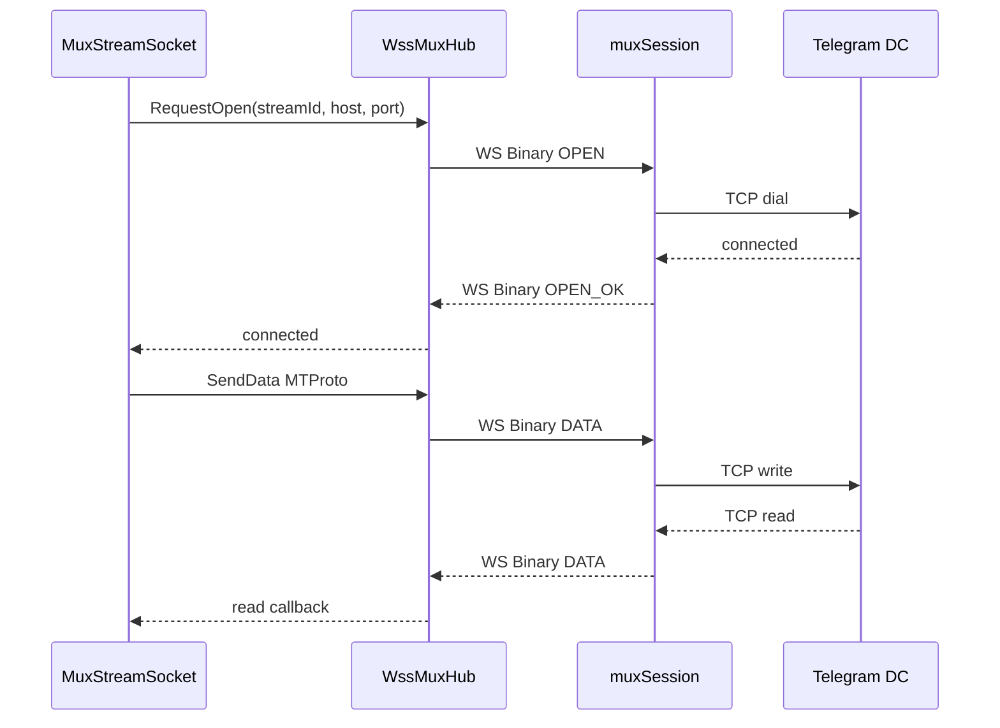

# WSS-MUX — техническая спецификация

Документ описывает схему, wire-протокол и реализацию WSS-MUX в ветке `wss-mux`: клиент Telegram Desktop и relay [`wss-relay`](.).

Операционный чеклист (деплой, флаги, мониторинг): [README.md](README.md).

---

## 1. Введение

### Проблема

Классический plain WSS-прокси держит **один WebSocket на одно MTProto-соединение**. При активной работе (main session, media DC, upload/download) это даёт:

- множество параллельных TLS handshakes к edge;
- head-of-line blocking внутри одного WS при конкурентных запросах;
- медленный старт media-загрузок из-за последовательного установления каналов.

### Решение

WSS-MUX держит **N постоянных WSS-туннелей** (1–9, по умолчанию 6) к прокси. Внутри каждого туннеля мультиплексируются **виртуальные TCP-streams** к Telegram DC. MTProto layer видит обычный сокет; MUX прозрачен.

### Стек



---

## 2. Терминология

| Уровень | Описание | Клиент | Relay |
|---------|----------|--------|-------|
| **Tunnel** | Одно WebSocket-соединение client↔relay | `WssMuxTunnel` | `muxSession` |
| **Stream** | Виртуальный TCP к DC внутри tunnel | `MuxStreamSocket` (`streamId`) | `muxStream` (map по `stream_id`) |
| **MTProto connection** | Обычное MTProto-соединение поверх stream | `TcpConnection` | — |



**`stream_id`** (uint32) назначает **клиент**. Relay проверяет уникальность и лимиты, но не генерирует ID.

---

## 3. Wire-протокол

Константы совпадают в клиенте ([`mtproto_wss_mux_framing.h`](../../Telegram/SourceFiles/mtproto/details/mtproto_wss_mux_framing.h)) и relay ([`mux.go`](mux.go)).

| Константа | Значение |
|-----------|----------|
| `kMuxVersion` / `muxVersion` | 1 |
| `kMuxHeaderSize` / `muxHeaderSize` | 8 |
| `kMuxMaxDataPayload` / `muxMaxDataPayload` | 64 KiB |
| Subprotocol | `tdesktop-mux/1` |

### 3.1 WebSocket handshake

| Параметр | Значение |
|----------|----------|
| Path | `/ws/mux` (фиксирован на клиенте; relay: `-mux-path`) |
| Subprotocol | `tdesktop-mux/1` |
| Auth | `Authorization: Bearer <token>` (опционально) |
| Compression | выключена |
| Запрещено | заголовок `X-Tg-Target` на mux-path → HTTP 400 |

После upgrade relay проверяет subprotocol; несовпадение → закрытие WS.

### 3.2 MUX frame

Каждый MUX-кадр упакован в **один WebSocket BinaryMessage**:

```
Offset  Size  Field
0       1     version (= 1)
1       1     type (opcode)
2       2     reserved (= 0, big-endian)
4       4     stream_id (uint32, big-endian)
8       N     payload
```

### 3.3 Opcodes

| Opcode | Hex | Направление | Payload |
|--------|-----|-------------|---------|
| OPEN | `0x01` | client → relay | target (см. ниже) |
| OPEN_OK | `0x02` | relay → client | пустой |
| OPEN_FAIL | `0x03` | relay → client | 1 byte: reason |
| DATA | `0x04` | оба | ≤ 64 KiB |
| CLOSE | `0x05` | оба | опционально |
| PING | `0x06` | оба | любой |
| PONG | `0x07` | ответ на PING | любой |

### 3.4 OPEN payload

```
uint16_be hostLen
hostLen bytes host (UTF-8)
uint16_be port
```

Пример: `149.154.167.35:443` → hostLen=15, host=`149.154.167.35`, port=443.

### 3.5 OPEN_FAIL reasons

| Code | Имя | Причина |
|------|-----|---------|
| 1 | Dial | TCP upstream failed или блокировка allowlist |
| 2 | BadTarget | duplicate `stream_id`, ошибка parse, пустой target |
| 3 | Limit | достигнут `-max-streams` |

### 3.6 Keepalive

Два независимых уровня:

1. **RFC 6455 WS Ping/Pong** — relay: `-ws-ping-interval` (default 30s), `-ws-read-timeout` (default 90s, продлевается при трафике/pong). Клиент: idle 2s / outgoing quiet 1.5s → WS ping.
2. **MUX PING/PONG** — application-level; relay отвечает `PONG` с тем же `stream_id`.

### 3.7 Открытие stream (sequence)



### 3.8 Закрытие stream

- client `CLOSE` / `UnregisterStream` → hub `requestCloseStream` → MUX `CLOSE` на relay, закрытие upstream TCP;
- upstream read/write error → relay `CLOSE` + `removeStream`;
- `-stream-idle-timeout` → relay `CLOSE` неактивных streams;
- WS disconnect → relay `closeAll()` всех streams в tunnel;
- смена tunnel для stream (main pick) → `CLOSE` на предыдущем tunnel перед `OPEN` на новом.

---

## 4. Клиент (Telegram Desktop)

### 4.1 Компоненты

| Файл | Роль |
|------|------|
| [`mtproto_wss_mux_hub.cpp/h`](../../Telegram/SourceFiles/mtproto/mtproto_wss_mux_hub.cpp) | Singleton hub на отдельном `QThread`; пул туннелей, маршрутизация, reconnect, DNS |
| [`mtproto_wss_mux_tunnel.cpp/h`](../../Telegram/SourceFiles/mtproto/mtproto_wss_mux_tunnel.cpp) | Один WSS к edge; `WebSocketSocket(muxTunnelMode=true)` |
| [`mtproto_wss_mux_stream_socket.cpp/h`](../../Telegram/SourceFiles/mtproto/mtproto_wss_mux_stream_socket.cpp) | Виртуальный `AbstractSocket`; chunking DATA по 64 KiB |
| [`mtproto_wss_mux_framing.cpp/h`](../../Telegram/SourceFiles/mtproto/details/mtproto_wss_mux_framing.cpp) | Encode/decode, stateful `MuxFrameDecoder` |
| [`mtproto_websocket_socket.cpp/h`](../../Telegram/SourceFiles/mtproto/details/mtproto_websocket_socket.cpp) | TLS + WS upgrade; MUX vs legacy plain WSS |
| [`mtproto_wss_connect_gate.cpp/h`](../../Telegram/SourceFiles/mtproto/mtproto_wss_connect_gate.cpp) | Лимит параллельных WSS handshakes |
| [`proxy_check.cpp/h`](../../Telegram/SourceFiles/mtproto/proxy_check.cpp) | Проверка прокси в UI; WSS → `EndProxyCheck` |

Hub работает на выделенном `QThread` (`hubThread`). Callbacks к `MuxStreamSocket` доставляются через `invokeQueued` на thread соединения (`postStreamEvent`, check-frames).

### 4.2 Жизненный цикл hub

1. `Application::refreshGlobalProxy` → `WssMuxHub::UpdateFromAppSettings(enabled, selected, done)` — единая точка включения/выключения WSS.
2. При `enabled && Type::WebSocket`: `proxyActive=true`, `resetTunnels` при смене config, `startTunnels`.
3. `TcpConnection::connectToServer` → `Configure` + `EnsureStarted` + `AcquireStream` → MUX `OPEN`.
4. После `OPEN_OK` — обычный MTProto поверх `read`/`write`.
5. Отключение прокси / `StopTunnels()` → `UpdateFromAppSettings(false, …)` (сброс туннелей, `WssConnectGate::Clear()`). 401 → toast через `SetAuthRejectedHandler`.

`Bootstrap(proxy)` — обёртка над `UpdateFromAppSettings(true, proxy)`. `SetProxyActive` — legacy-флаг, основной путь через `UpdateFromAppSettings`.

**DNS / старт туннелей:**

- Если hostname требует resolve и известен ≤1 IP — старт откладывается (`deferTunnelStartUntilResolve`), параллельно `startSystemResolve()`.
- Fallback через 10s (`kDeferResolveFallback`): `startTunnels(allowHostnameFallback=true)` — connect по hostname без multi-IP.
- Resolved IPs дедуплицируются (`DedupeIps`); порядок round-robin хранится в `ipPickOrder` (shuffle при обновлении набора).
- `Configure` из `TcpConnection`: если hub уже `proxyActive` с непустым `config.host`, повторный `Configure` с **другим** endpoint игнорируется — защита от шторма reconnect.
- `ApplyResolvedIps` — debounce 3s; при >1 IP запускает отложенный `startTunnelsAfterResolve`.
- **DNS прокси:** для WSS host с `tryCustomResolve` — только system DNS (`DomainResolver::resolveSystemOnly`), без DoH (`mtp_instance.cpp`).
- **Shutdown:** `Sandbox::closeApplication()` → `WssMuxHub::Shutdown()` (`BlockingQueuedConnection` + `hubThread.wait()`).

### 4.2.1 Proxy check (изолированные check-сессии)

Проверка WSS в UI (`connection_box`, «Check») не использует основной пул туннелей — иначе при списке из нескольких прокси возникает шторм connect/reconnect.

| API | Назначение |
|-----|------------|
| `AcquireCheckStream(..., whenRegistered)` | Lazy-start check-сессии; async assign `streamId` на hub thread → callback → `connectToHost` |
| `CancelCheckStreamSetup(setupId)` | Отмена pending setup (если checker уничтожен до регистрации) |
| `EndProxyCheck(proxy)` | Закрывает check-сессию по ключу check-сессии |

Ключ check-сессии: endpoint (SNI или host) + port + path + password. Check-туннель отделён от production `tunnels[]`.

**Особенности UI:**

- При открытии списка прокси checks **staggered** — задержка +100ms на каждый следующий (не параллельный шторм).
- `TcpConnection(forProxyCheck=true)` debug tag: `wssmuxcheck` (production: `wssmux`).
- `connectToHost` для WSS check вызывается только в `whenRegistered`, после async assign `streamId`.
- Hub **не блокирует UI thread** через `QEventLoop` при proxy check (fix зависания настроек прокси).

### 4.3 Интеграция с MTProto

| Файл | Поведение |
|------|-----------|
| [`connection_tcp.cpp`](../../Telegram/SourceFiles/mtproto/connection_tcp.cpp) | `ProxyData::Type::WebSocket` → `WssMuxHub::AcquireStream()`; `_address/_port` = **целевой DC**, не прокси |
| [`connection_resolving.cpp`](../../Telegram/SourceFiles/mtproto/connection_resolving.cpp) | WSS не перебирает IP после первого успешного |
| [`mtp_instance.cpp`](../../Telegram/SourceFiles/mtproto/mtp_instance.cpp) | Resolved IPs → `ApplyResolvedIps`; WSS proxy host → system DNS only (no DoH) |
| [`session_private.cpp`](../../Telegram/SourceFiles/mtproto/session_private.cpp) | WSS endpoint pick (`PickWssEndpointCandidateIndex`); defer media DC (до 15s); `setWssTunnelAffinity` для download **и upload**; reassembly stall → rotate endpoint (main, ≥25s); увеличенные receive timeouts для media cluster |
| [`details/mtproto_domain_resolver.cpp`](../../Telegram/SourceFiles/mtproto/details/mtproto_domain_resolver.cpp) | `resolveSystemOnly` для WSS proxy host |

### 4.4 Tunnel affinity

Константы hub ([`mtproto_wss_mux_hub.cpp`](../../Telegram/SourceFiles/mtproto/mtproto_wss_mux_hub.cpp)):

| Константа | Значение | Назначение |
|-----------|----------|------------|
| `kDefaultTunnelCount` | 6 | default `tunnels` |
| `kDownloadTunnelSlots` | 8 | первые 8 туннелей для main traffic |
| `kReconnectDelay` | 2s | reconnect tunnel |
| `kOpenRetryDelay` | 250ms | retry pending opens |
| `kIpUpdateDebounce` | 3s | debounce DNS update |
| `kDeferResolveFallback` | 10s | старт без multi-IP resolve |
| `kTunnelStreamFailGrace` | 2s | grace перед `failStreamsOnTunnel` при кратковременном disconnect |

**Main traffic** (`tunnelAffinity < 0`): `pickTunnel()` → `pickAnyConnectedTunnelIndex()`: least-loaded среди первых `min(tunnelCount, 8)` туннелей; туннели с download-streams исключаются из main pick.

**Download/upload traffic** (`tunnelAffinity >= 0`): привязка к `affinity % tunnelCount`; если целевой tunnel down — fallback на любой connected tunnel (`pickAnyConnectedTunnelIndex`).

Формула affinity для download/upload DC ([`session_private.cpp`](../../Telegram/SourceFiles/mtproto/session_private.cpp)):

```
base = isDownloadDcId ? kBaseDownloadDcShift : kBaseUploadDcShift
index = (GetDcIdShift(shiftedDcId) - base) + BareDcId(shiftedDcId) * kMaxMediaDcCount
```

### 4.4.1 WSS endpoint pick (Telegram DC)

При WSS прокси session выбирает **один** TCP endpoint из candidates (`PickWssEndpointCandidateIndex`):

- **upload/download DC:** только IPv4 candidates (если есть); индекс `(shift + _wssPickOffset) % ipv4Count`. При включённой галке IPv6 в настройках прокси upload/download не попадают на v6 endpoint.
- **main DC:** `(shift + _wssPickOffset) % candidates.size()` (IPv4 и IPv6).
- `_wssPickOffset` увеличивается при reassembly stall (main) и `restartWssWithNextEndpoint()`.

### 4.4.2 Tunnel disconnect / reconnect

При disconnect tunnel: `scheduleFailStreamsOnTunnel` — grace **2s** (`kTunnelStreamFailGrace`); если tunnel не восстановился — `failStreamsOnTunnel` (MUX `CLOSE` + `handleTunnelDown` на streams). Reconnect до истечения grace отменяет fail (`cancelPendingFailStreamsOnTunnel`). Generation counter (`tunnelFailGenerations`) защищает от гонок пересоздания.

### 4.5 Connect gate

`WssConnectGate`: лимит одновременных WSS handshakes = `clamp(tunnelCount, 1, 9)`. `tryAcquire` / `release` в `WebSocketSocket::connectMuxTunnel`. Сбрасывается в `StopTunnels()`.

### 4.5.1 Reassembly stall rotation (main session)

При WSS на main DC: если reassembly одного ответа занимает ≥25s суммарно (`kWssCumulativeStallRotateThreshold`) и есть альтернативные TCP endpoints — session переключает endpoint (`_wssPickOffset++`). Для download/upload DC rotation отключена.

### 4.6 Media download / upload

При активном WSS-MUX прокси download/upload используют расширенные таймауты и warm-up параллельных сессий.

| Параметр | Обычный прокси | WSS-MUX |
|----------|----------------|---------|
| Download kill session timeout | 15s | 3 min |
| Download bad request threshold | 8s | 45s (не срабатывает, пока `dc.totalRequested > 0`) |
| Download initial sessions | 1 | 3 |
| Download max waited per session | 16 parts | 8 parts |
| Download warm-up settle delay | — | 150ms |
| Download slow log threshold | — | 2s (DEBUG + tunnel loads) |
| Download stall log threshold | — | 10s |
| Upload kill session timeout | default | 3 min |
| Upload fast request threshold | default | 5s |
| Upload initial sessions (файл ≥ 2 MiB) | 1 | 3 |
| Upload warm-up settle delay | — | 150ms |
| Upload slow request threshold | default | 30s |
| Upload `canAddDcIndex` (первые N сессий) | fast gate (512 KiB) | первые 3 без fast gate |
| Upload warm-up min ready | — | 1 session (index 0); index ≥1 ждёт `isWarmUpReady()` |

Файлы: [`download_manager_mtproto.cpp`](../../Telegram/SourceFiles/storage/download_manager_mtproto.cpp), [`file_upload.cpp`](../../Telegram/SourceFiles/storage/file_upload.cpp).

Stream open timeout на клиенте: **15s** (`kOpenTimeout` в `mtproto_wss_mux_stream_socket.cpp`).

### 4.7 Конфигурация

**Ссылка:**

```
tg://wss?server=HOST&port=443&tunnels=6&token=TOKEN
```

| Параметр | Поле `ProxyData` | Примечание |
|----------|------------------|------------|
| `server` | `host` | |
| `port` | `port` | |
| `token` | `password` | Bearer token |
| `tunnels` | `wssMuxTunnels` | 1–9, default 6 |
| `path` | — | всегда `/ws/mux` (принудительно) |

`sniHost` — поле `ProxyData`, default = `host`; в `tg://wss` и UI не задаётся, только сериализация.

Парсинг: [`connection_box.cpp`](../../Telegram/SourceFiles/boxes/connection_box.cpp), [`mtproto_proxy_data.cpp`](../../Telegram/SourceFiles/mtproto/mtproto_proxy_data.cpp). Персистенция: [`core_settings_proxy.cpp`](../../Telegram/SourceFiles/core/core_settings_proxy.cpp).

### 4.8 Plain WSS vs MUX

Клиент сохраняет legacy `WebSocketSocket` без mux mode (target через `X-Tg-Target` или path `/ws/HOST/PORT`), но **`TcpConnection` использует только MUX**. Relay принимает **только** `/ws/mux`.

| | Plain WSS (legacy) | WSS-MUX |
|---|-------------------|---------|
| Path | `/ws` или `/ws/HOST/PORT` | `/ws/mux` |
| Subprotocol | нет | `tdesktop-mux/1` |
| Target | `X-Tg-Target: host:port` | OPEN frame per stream |
| Payload | raw MTProto в WS binary | 8-byte mux header + data |
| Connections | 1 WS = 1 TCP upstream | 1 WS = N TCP streams |
| Relay support | нет | да |

---

## 5. Relay (wss-relay)

### 5.1 Entry point

[`main.go`](main.go): HTTP listener (default `127.0.0.1:8283`); единственный WS handler — mux path; stats на `/stats`.

### 5.2 Session lifecycle

[`mux.go`](mux.go):

```
handleMux
  → reject X-Tg-Target
  → auth.validate()
  → muxTunnelLimiter.tryAcquire(clientIP)
  → WS upgrade (subprotocol tdesktop-mux/1)
  → muxSession.readLoop()
      → WS ping goroutine
      → idle stream sweeper
      → read WS BinaryMessages → decodeMuxFrame → dispatch
  defer: closeAll(), limiter.release(), stats
```

**Stream open** (`openStreamAsync`):

```
parseOpenTarget → dialUpstream (async)
  → fail: OPEN_FAIL
  → ok: streams[id]=muxStream, OPEN_OK, go pumpUpstream
```

**DATA routing:** client→relay → `stream.tcp.Write`; relay→client ← `stream.tcp.Read` (до 64 KiB) → `muxTypeData`.

### 5.3 Upstream

[`upstream.go`](upstream.go) + [`telegram_allowlist.go`](telegram_allowlist.go):

- `-telegram-only` (default `true`): CIDR из [`telegram_cidrs.txt`](telegram_cidrs.txt) ([official list](https://core.telegram.org/resources/cidr.txt));
- DNS resolve до dial + verify peer IP после connect;
- `tuneTCP`: `TCP_NODELAY`, 512 KiB read/write buffers.

### 5.4 Лимиты

| Flag | Default | Эффект |
|------|---------|--------|
| `-max-tunnels-per-ip` | 12 | concurrent WS tunnels per client IP (≈ tunnels×2 для reconnect overlap); 0 = off |
| `-max-streams` | 256 | streams per tunnel |
| `-stream-idle-timeout` | 10m | close idle streams (zombie cleanup); 0 = off |
| `-ws-ping-interval` | 30s | WS ping per tunnel; 0 = off |
| `-ws-read-timeout` | 90s | read deadline; 0 = off |

Tunnel limit exceeded → HTTP 429 `too many mux tunnels`.

**Upstream read stall** (диагностика, не закрытие stream): `pumpUpstream` ставит read deadline 3s; при timeout — retry read. После ≥32 KiB sent upstream без чтения 3s — log + stats increment. Stream закрывается только при реальной ошибке read (не timeout).

### 5.5 Auth

[`auth.go`](auth.go):

- `-auth-file` — SHA-256 hex hashes, one per line;
- `-auth-token` — plaintext token (dev only);
- `subtle.ConstantTimeCompare` при проверке;
- без флагов — anonymous (backward compatible).

### 5.6 Client IP

[`client_ip.go`](client_ip.go): `X-Real-IP` → первый hop `X-Forwarded-For` → `RemoteAddr`.

### 5.7 Мониторинг

[`stats.go`](stats.go), [`monitor.go`](monitor.go): UI `/stats` (refresh 2s), JSON `/stats/json`. Отключить: `-stats-path=""`.

---

## 6. Edge proxy

Edge терминирует TLS; до relay идёт plain WS на `127.0.0.1:8283`.

| Пример | Назначение |
|--------|------------|
| [`nginx.conf.example`](nginx.conf.example) | `limit_conn` на `/ws/mux`, `X-Real-IP` |
| [`Caddyfile.example`](Caddyfile.example) | `read_timeout` / `write_timeout` ~2m |

Длинные edge timeouts без активности держат мёртвые client connections и relay tunnels открытыми часами — держать ~2m.

---

## 7. Обработка ошибок

| Событие | Клиент | Relay |
|---------|--------|-------|
| 401 на WS upgrade | `markAuthRejected`, toast | HTTP 401 + `WWW-Authenticate: Bearer` |
| OPEN_FAIL Dial | retry / next endpoint | — |
| OPEN_FAIL BadTarget | error на stream | — |
| OPEN_FAIL Limit | backoff | — |
| Bad mux frame (version, oversized DATA) | close tunnel | close tunnel (`readLoop` return) |
| Unknown frame type | ignore | log, continue |
| DATA на unknown stream | — | `CLOSE(stream_id, [1])` |
| TCP write error (client→upstream) | — | `removeStream` |
| Upstream read error | stream error | `CLOSE` + `removeStream` |
| WS disconnect | reconnect tunnels (grace 2s) | `closeAll()` |
| Tunnel brief disconnect | grace 2s → `failStreamsOnTunnel` или cancel при reconnect | — |
| Idle stream | — | `CLOSE` по `-stream-idle-timeout` |
| Tunnel limit | connect error | HTTP 429 |

---

## 8. Карта исходников

### Клиент

| Файл | Назначение |
|------|------------|
| `mtproto/mtproto_wss_mux_hub.cpp/h` | Центральный multiplexer |
| `mtproto/mtproto_wss_mux_tunnel.cpp/h` | WSS-туннель к прокси |
| `mtproto/mtproto_wss_mux_stream_socket.cpp/h` | Виртуальный TCP для MTProto |
| `mtproto/details/mtproto_wss_mux_framing.cpp/h` | Бинарный MUX-протокол |
| `mtproto/details/mtproto_websocket_socket.cpp/h` | TLS+WS transport |
| `mtproto/mtproto_wss_connect_gate.cpp/h` | Лимит параллельных connect |
| `mtproto/connection_tcp.cpp` | MTProto → MUX entry point |
| `mtproto/connection_resolving.cpp` | DNS/IP для WSS |
| `mtproto/mtproto_proxy_data.cpp/h` | Тип, валидация, `wssMuxTunnels` |
| `mtproto/mtp_instance.cpp` | Resolved IPs → hub |
| `mtproto/session_private.cpp` | Endpoint selection, download affinity |
| `core/core_settings_proxy.cpp` | Персистенция proxy |
| `core/application.cpp` | `refreshGlobalProxy` → `UpdateFromAppSettings` |
| `core/sandbox.cpp` | `WssMuxHub::Shutdown()` при выходе |
| `mtproto/details/mtproto_domain_resolver.cpp` | System DNS для WSS proxy |
| `boxes/connection_box.cpp` | UI + tg://wss + proxy check |
| `mtproto/proxy_check.cpp/h` | Proxy check; WSS → `EndProxyCheck` |
| `storage/download_manager_mtproto.cpp` | Download warm-up/limits |
| `storage/file_upload.cpp` | Upload warm-up/limits |

### Relay

| Файл | Назначение |
|------|------------|
| `main.go` | Flags, HTTP router |
| `mux.go` | MUX protocol, session |
| `mux_limits.go` | Per-IP tunnel limiter |
| `upstream.go` | TCP dial + tune |
| `telegram_allowlist.go` | Telegram CIDR check |
| `auth.go` | Bearer token auth |
| `client_ip.go` | Client IP extraction |
| `stats.go` / `monitor.go` | Monitoring dashboard |
| `mux_test.go` | Protocol unit tests |
| `analyze_dc_pcap.py` | Анализ pcap: gaps inbound data client↔DC |

---

## 9. Тесты и диагностика

**Relay** ([`mux_test.go`](mux_test.go)):

- encode/decode OPEN frame + `parseOpenTarget`;
- reject oversized DATA (> 64 KiB);
- tunnel limiter acquire/release;
- client IP from `X-Real-IP` / `X-Forwarded-For`.

**Клиент:** `MuxFrameDecoder` + encode helpers в [`mtproto_wss_mux_framing.cpp`](../../Telegram/SourceFiles/mtproto/details/mtproto_wss_mux_framing.cpp).

**Pcap-анализ** ([`analyze_dc_pcap.py`](analyze_dc_pcap.py)): разбор `.pcap` — TCP payload client↔DC, статистика gaps между inbound data (avg/p95/max, gaps ≥1s/3s/5s). Для отладки медленных download через mux.

```bash
python3 analyze_dc_pcap.py capture.pcap
```

---

## 10. История ветки wss-mux

| Коммит | Суть |
|--------|------|
| `c451fbb329` | Initial: hub, relay, framing |
| `54782d4b06` | Zombie stream cleanup (client + server idle timeout) |
| `aa3ca1e0c5` | Media download на дополнительных аккаунтах |
| `ca86125f59`, `2c31f8b5ac`, `06ccd1e4ed` | Upload/download tuning, warm-up sessions, stabilize media download |
| `025b1fd393` | Не подключаться к WSS когда прокси выключен |
| `6a5036e7dd` / `a00744fd14` | Proxy check sessions, Qt6, ping UI, reassembly stall rotation, relay upstream read deadline |
| `43b6eb4320` | Fix зависания настроек прокси (убран blocking `QEventLoop` в hub) |
| `65bd2ba027`, `25a11b702f` | `UpdateFromAppSettings`, async `AcquireCheckStream`, `ipPickOrder`, `Configure` endpoint guard, staggered proxy checks |
| `02d6cbaf56` | Zombie tunnels: `tunnelFailGenerations`, grace 2s; system DNS (no DoH); `Shutdown` из sandbox |
| `8ab581b6c1` | Upload: IPv4 endpoint pick, upload tunnel affinity, relaxed `canAddDcIndex`, warm-up fixes |

---

## См. также

- [README.md](README.md) — деплой, флаги relay, ссылка `tg://wss`, мониторинг
